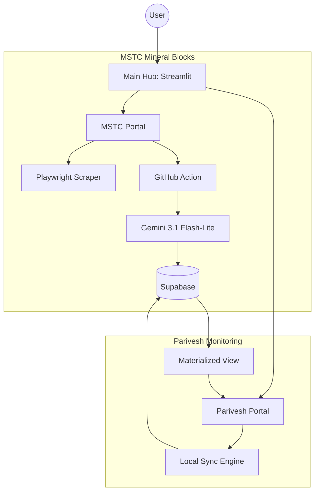

# Web Automation Hub 🚀

A multi-project automation intelligence system for mining and environmental data monitoring. Built with **Streamlit**, **Playwright**, **Google Gemini LLM**, and **Supabase**.

---

## 🏗️ System Architecture

The project operates as a unified hub that routes to specialized automation portals.



---

## ✨ Key Features

### 💎 MSTC Mineral Blocks
- **Automated Discovery**: Scans MSTC auction portals for new mineral block notices.
- **AI Extraction**: Uses **Gemini 3.1 Flash-Lite** to extract structured geological, land area, and resource data from complex PDFs.
- **Async Processing**: Offloads heavy LLM tasks to **GitHub Actions** to ensure a snappy UI experience.

### 🌿 Parivesh Monitoring
- **Real-time Sync**: Pulls meeting agendas and minutes (MOM) directly from government environmental portals.
- **Keyword Intelligence**: Automated scanning of document text for high-value monitoring keywords.
- **Unified Timeline**: Consolidates agendas and minutes into a single project-view using PostgreSQL Materialized Views.

---

## 🛡️ Security Architecture

The system implements a zero-trust-style security model for public dashboards:

- **Row-Level Security (RLS)**: All Supabase tables are locked down. The public can only `SELECT` (read) data.
- **Service Role Access**: Backend scrapers and GitHub Actions utilize the `service_role` key to bypass RLS for secure `INSERT` and `UPDATE` operations.
- **Environment Safety**: Sensitive credentials are managed via `.env` (local) and GitHub Secrets (production).

---

## 🛠️ Tech Stack

- **Frontend**: Streamlit (Python)
- **Scraping**: Playwright
- **AI/LLM**: Google Gemini API (3.1 Flash-Lite, 2.5 Flash)
- **Database**: Supabase (PostgreSQL)
- **PDF Processing**: Microsoft MarkItDown
- **CI/CD**: GitHub Actions

---

## 🚀 Getting Started

1. **Clone and Install**:
   ```bash
   git clone https://github.com/learningmaps/web_automation_ms.git
   cd web_automation_ms
   pip install -r requirements.txt
   ```

2. **Environment Setup**:
   Create a `.env` file based on `.env.example`:
   ```bash
   SUPABASE_URL=your_url
   SUPABASE_KEY=your_service_role_key
   DATABASE_URL=your_direct_postgres_url
   ```

3. **Run the Hub**:
   ```bash
   streamlit run main_app.py
   ```

---

## 📂 Project Structure

- `main_app.py`: The central hub and navigation logic.
- `/projects`: Individual automation modules (MSTC, Parivesh).
- `/common`: Shared logic for document processing and LLM utilities.
- `/maintenance`: Local testing and validation scripts (git-ignored).

---
*Built for specialized intelligence gathering and automated data entry.*
