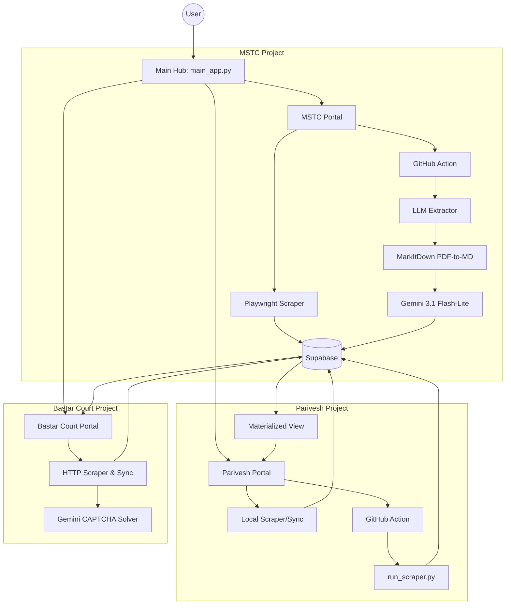

# Project Flow: Web Automation System

This document provides a comprehensive overview of the architecture, user interface, and data flow of the Web Automation project.

## 1. High-Level Architecture

The system is a multi-project automation hub built with **Streamlit**, **Playwright**, **Gemini LLM**, and **Supabase (PostgreSQL)**.

---

## 2. User Interface Flow

### 2.1 Unified Hub (`main_app.py`)
- **Entry Point**: The landing page displays high-level metrics (Total blocks, processed PDFs, keyword hits, court cases) fetched from both `mstc`, `parivesh`, and `bdc` schemas.
- **Navigation**: Three primary cards allow the user to launch specific project portals:
  - **MSTC Mineral Blocks**: Structured extraction from auction notices.
  - **Parivesh Monitoring**: Environmental clearance tracking.
  - **Bastar Court Cases**: Case status monitoring for Bastar District Court.

### 2.2 MSTC Portal (`projects/mstc_py/app.py`)
- **Metrics Bar**: Displays real-time counts of `Pending`, `Processed`, and `Failed` PDFs.
- **Controls**:
  - **Local Fetch**: Triggers the local Playwright scraper to find new PDF links from MSTC pages and save them to the DB.
  - **Run Pipeline**: Triggers a remote GitHub Action pipeline that runs both the Crawler and the Extractor sequentially.
  - **Extract Only**: Triggers a remote GitHub Action pipeline to only run the Extractor on existing pending PDFs.
- **Data Views**:
  - **Scraped URLs**: Tracks the discovery and status of every PDF.
  - **Mine Block Summaries**: Shows extracted geological and land data.
  - **Tenders (NIT)**: Shows auction schedules and individual mineral blocks.

### 2.3 Parivesh Portal (`projects/parivesh_auto/app.py`)
- **Controls**:
  - **Fetch New Documents**: Runs a local sync process to download metadata and PDFs from the Parivesh server.
  - **Refresh View**: Manually refreshes the PostgreSQL Materialized View for updated consolidation.
- **Filters**: Advanced filtering by State, Committee Type, Keywords, and Date ranges.
- **Data Table**: Displays a consolidated view of Agendas and Minutes of Meetings (MOM).

### 2.4 Bastar Court Portal (`projects/bdc_scrape/app.py`)
- **Metrics Bar**: Displays total cases, pending vs disposed, and the "Data Last Synced" timestamp.
- **Controls**:
  - **Sync**: Triggers the remote GitHub Actions scraper workflow asynchronously to fetch the latest cases.
  - **Refresh**: Reloads the dashboard data from Supabase immediately via a streamlit rerun.
- **Data Views**:
  - **Case List**: Displays a filterable table of court cases. Supports interactive row selection (`on_select="rerun"`) to dynamically load details of the selected case below.
  - **Case Details Viewer**: Continuous vertical dossier docket showing overview, parties, acts & sections, FIR details, hearing history, and PDF order tables in stacked visual cards (enabling seamless page-level Ctrl+F text searches).

---

## 3. Data Flow: MSTC Mineral Blocks

### Stage 1: Discovery (Scraping)
1. **User Action**: Clicks "Local Fetch" in the MSTC Portal, or triggers a remote run via "Run Pipeline" on GitHub Actions.
2. **Logic**: `scraper.py` queries MSTC listing pages.
3. **Storage**: Discovered PDF URLs are saved into `mstc.processed_pdfs` with status `pending`.

### Stage 2: Extraction (LLM Processing)
1. **User Action**: Clicks "Run Pipeline" (triggers Crawl then Extract) or "Extract Only" in the MSTC Portal, or execution occurs via weekly automated schedule.
2. **Trigger**: Streamlit calls the GitHub API to dispatch the `extract_pdfs.yml` workflow with either `task: "both"` or `task: "extract"`.
3. **Execution**: The workflow runs `projects/mstc_py/main.py`:
   - **Download**: Downloads the PDF from the stored URL.
   - **Conversion**: `common.document_processing` uses `markitdown` to convert the PDF to Markdown.
   - **Extraction**: `extractor.py` sends the Markdown to **Gemini 3.1 Flash-Lite** with a structured Pydantic schema.
   - **Fallback**: If the primary model fails, it tries `Gemini 2.5 Flash`, then `Gemini 3 Flash-Preview`.
4. **Storage**:
   - Structured data is saved into `mstc.mine_block_summaries` or `mstc.tenders_nit` & `mstc.tender_blocks`.
   - The record in `mstc.processed_pdfs` is updated to `processed` with a timestamp.

---

## 4. Data Flow: Parivesh Monitoring

### Stage 1: Metadata Sync & PDF Extraction (Trigger)
1. **Manual / Scheduled Action**: A weekly GitHub Action cron job (`parivesh_scrape.yml` at 03:00 UTC Mondays) or manual trigger runs `run_scraper.py`. Optionally, the user can click "Fetch New Documents" in the Streamlit Parivesh Portal for local execution.
2. **Logic**: `run_scraper.py` (calling `PariveshScraper` in `utils.py`) queries Parivesh APIs for recent meeting records (SEIAA, SEAC, EAC).
3. **Storage**: Initial metadata is stored in `parivesh.agenda_v3`.

### Stage 2: Document Processing & Consolidation
1. **PDF Sync**: The scraper downloads the associated Agenda and MOM PDFs.
2. **Keyword Matching**: Subject lines and PDF text are converted to Markdown using `markitdown` and scanned for specific monitoring keywords.
3. **Consolidation**: A PostgreSQL Materialized View (`parivesh.mv_consolidated_projects`) joins related Agendas and MOMs based on meeting IDs.
4. **Visualization**: Streamlit fetches from this view to present a unified project timeline.

---

## 4b. Data Flow: Bastar Court Cases (BDC Scrape)

### Stage 1: Geoblocking Bypass & HTTP Proxying
To bypass the eCourts Web Application Firewall (WAF) which geoblocks cloud services and public proxies, all scraper HTTP requests are routed through a trusted Indian database server:
1. **Supabase SQL Session (`SupabaseSQLSession`)**: A drop-in custom `requests`-compatible session class.
2. **PostgreSQL Proxy Relay**: Outgoing GET/POST requests are serialized and executed inside PostgreSQL on an AWS Mumbai (`ap-south-1`) instance using the `http` extension.
3. **Binary Handling**: CAPTCHA images and order PDFs are downloaded as binary data through PostgreSQL using `textsend(content)` to prevent null-byte truncation.
4. **Timeouts**: Safe database query connection and execution timeouts (`statement_timeout`, `http.timeout_msec`) prevent hanging on network latency.

### Stage 2: Session Initiation & CAPTCHA Solving
1. **Trigger**: Scraper starts (scheduled or manual button click).
2. **HTTP GET**: Fetches the initial search page via the SQL proxy to extract form tokens (`scid`, `tok_*`).
3. **CAPTCHA Download**: Downloads the CAPTCHA image via the SQL proxy (retaining session cookies in python memory).
4. **Gemini Solve**: Sends the CAPTCHA image data to **Gemini 3.1 Flash-Lite** to solve the text.
5. **Retry Loop**: If verification fails due to an incorrect CAPTCHA code, the scraper re-downloads and re-solves only the CAPTCHA image. It reuses the original search tokens and PHP session cookie, completely bypassing any base page reload.

### Stage 3: Search Request & Dynamic Scraping
1. **HTTP POST**: Submits case search parameters (case type, year, status, solved CAPTCHA text, tokens) to the AJAX search endpoint via the SQL proxy.
2. **Parsing**: Parses the returned HTML to identify CNR numbers (`data-cno`) and establishment codes (`data-est-code`).
3. **HTTP Details POST**: Sequentially queries the details AJAX endpoint via the SQL proxy to fetch the HTML content of each case.
4. **Order PDF Sync**: Checks existing records in `bdc.case_orders` for the given CNR. For each order in the current case, if it was already synced (matching order date), the scraper reuses the S3 URL. Only new/unsynced orders are downloaded through the SQL proxy and uploaded to Supabase Storage, dramatically reducing execution time and proxy overhead.
5. **Print Layout PDF**: Headless Playwright renders the HTML locally to generate an A4 details PDF. To bypass WAF geoblocking of styles and image assets (national emblem, logos, etc.), the generator:
    - Loads a static website template `page_template.html` (constructed from the court's outer page skeleton).
    - Injects the compiled stylesheet (`court_styles.css`) and dynamic case HTML (`details_html`) into placeholders.
    - Dynamically injects a `<base>` tag (pointing to the workspace root) so the browser loads pre-downloaded local logo assets (`projects/bdc_scrape/assets/`).
    - Emulates `screen` media query (`emulate_media(media="screen")`) in Playwright before printing, ensuring all card borders, backgrounds, colors, and layout widths render exactly like the live website view.

### Stage 4: Database Storage
1. **Extraction**: Parses details HTML into structured tables: Case Details, Status, Petitioners, Respondents, Acts, and Hearing History.
2. **Supabase Sync**: Inserts or updates records in `bdc.cases`, `bdc.case_history`, and `bdc.case_orders` schemas.

---

---

## 5. Technical Infrastructure

### Database Schema (Supabase/PostgreSQL)
- **Schema `mstc`**:
  - `processed_pdfs`: Master registry of all discovered files.
  - `mine_block_summaries`: Detailed geological/resource data.
  - `tenders_nit` & `tender_blocks`: Auction-related information.
- **Schema `parivesh`**:
  - `agenda_v3`: Flat table containing metadata, keyword matches, and raw text.
  - `mv_consolidated_projects`: Materialized view for cross-referencing documents.
- **Schema `bdc`**:
  - `cases`: Main case details (CNR, Case Type, Case Year, Establishment Code, Petitioner, Respondent, Status, Next Hearing Date).
  - `case_history`: Detailed logs of hearings, stages, and business history.

### Shared Logic
- **`common/document_processing.py`**: Standardized PDF-to-Markdown conversion using the `markitdown` library.
- **`GEMINI.md`**: Project-wide mandates for extraction models, visual identity (Streamlit Red `#ff4b4b`), and directory structure.

### External Integrations
- **GitHub Actions**: Offloads heavy scraper metadata fetching and PDF processing tasks to GitHub's infrastructure (MSTC, Bastar Court, and Parivesh scrapers) to avoid Streamlit timeout limits.
- **Google Gemini API**: Provides high-reasoning extraction capabilities with deterministic output (`temperature=0.0`) and solves scraper CAPTCHAs.

### Verification Utilities
- **`supabase/functions/test-waf`**: A utility Edge Function designed to test direct HTTP requests from Supabase cloud environments to the Bastar Court website to verify WAF geoblocking behaviour.

## 6. Security Architecture

### Row-Level Security (RLS)
The Supabase database is secured using RLS on all tables in the `mstc`, `parivesh`, and `bdc` schemas.
- **Public Access**: Limited to `SELECT` operations only. This allows the Streamlit dashboards to display data without authentication while preventing unauthorized modifications.
- **Backend Access**: Scrapers and GitHub Actions use the **`service_role`** secret key. This key bypasses RLS, allowing these trusted processes to `INSERT`, `UPDATE`, and `DELETE` records as needed.

### Environment Management
- **Local Development**: Sensitive keys are stored in a `.env` file, which is excluded from source control.
- **GitHub Actions**: The `service_role` key and Supabase URL are managed via GitHub Repository Secrets.

---

## 7. Python Imports & Search Path Architecture

In a persistent multi-app monorepo environment (like Streamlit Cloud), the system isolates sub-project imports using absolute package paths rather than dynamic runtime search path modification (`sys.path.append(current_dir)`).

### Search Path Setup
1. **Unified Hub**: The root launcher `main_app.py` appends the `projects/` directory to `sys.path`. This enables importing sub-project dashboards as top-level modules (e.g., `from mstc_py.app import run_mstc`).
2. **Sub-projects**: Each sub-project's entry points (`app.py`, `main.py`, etc.) dynamically insert the parent `projects/` directory to `sys.path` (rather than their own sub-folder directory).
3. **Module Resolution**: All internal module imports within sub-projects specify the package prefix (e.g., `from mstc_py.scraper import ...` or `from parivesh_auto.constants import ...`). This prevents Python's `sys.modules` cache from encountering namespace collisions for duplicate filenames (like `scraper.py`, `constants.py`, and `utils.py`).

