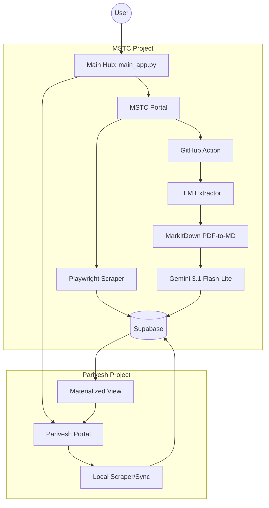

# Project Flow: Web Automation System

This document provides a comprehensive overview of the architecture, user interface, and data flow of the Web Automation project.

## 1. High-Level Architecture

The system is a multi-project automation hub built with **Streamlit**, **Playwright**, **Gemini LLM**, and **Supabase (PostgreSQL)**.

---

## 2. User Interface Flow

### 2.1 Unified Hub (`main_app.py`)
- **Entry Point**: The landing page displays high-level metrics (Total blocks, processed PDFs, keyword hits) fetched from both `mstc` and `parivesh` schemas.
- **Navigation**: Two primary cards allow the user to launch specific project portals:
  - **MSTC Mineral Blocks**: Structured extraction from auction notices.
  - **Parivesh Monitoring**: Environmental clearance tracking.

### 2.2 MSTC Portal (`projects/mstc_py/app.py`)
- **Metrics Bar**: Displays real-time counts of `Pending`, `Processed`, and `Failed` PDFs.
- **Controls**:
  - **Fetch**: Triggers the Playwright scraper to find new PDF links from MSTC pages.
  - **Extract**: Triggers a remote GitHub Action to perform LLM-based data extraction.
- **Data Views**:
  - **Scraped URLs**: Tracks the discovery and status of every PDF.
  - **Mine Block Summaries**: Shows extracted geological and land data.
  - **Tenders (NIT)**: Shows auction schedules and individual mineral blocks.

### 2.3 Parivesh Portal (`projects/parivesh_auto/app.py`)
- **Controls**:
  - **Fetch New Documents**: Runs a local sync process to download metadata and PDFs from the Parivesh server.
  - **Refresh View**: Manually refreshes the PostgreSQL Materialized View for updated consolidation.
- **Filters**: Advanced filtering by State, Committee Type, Keywords, and Date ranges.
- **Data Table**: Displays a consolidated view of Agendas and Minutes of Meetings (MOM).

---

## 3. Data Flow: MSTC Mineral Blocks

### Stage 1: Discovery (Scraping)
1. **User Action**: Clicks "Fetch" in the MSTC Portal.
2. **Logic**: `scraper.py` uses Playwright to navigate MSTC listing pages.
3. **Storage**: Discovered PDF URLs are saved into `mstc.processed_pdfs` with status `pending`.

### Stage 2: Extraction (LLM Processing)
1. **User Action**: Clicks "Extract" in the MSTC Portal.
2. **Trigger**: Streamlit calls the GitHub API to dispatch the `extract_pdfs.yml` workflow.
3. **Execution**: The workflow runs `projects/mstc_py/main.py`:
   - **Download**: Downloads the PDF from the stored URL.
   - **Conversion**: `common.document_processing` uses `markitdown` to convert the PDF to Markdown.
   - **Extraction**: `extractor.py` sends the Markdown to **Gemini 3.1 Flash-Lite** with a structured Pydantic schema.
   - **Fallback**: If the primary model fails, it tries `Gemini 2.5 Flash`, then `Gemini 3 Flash-Preview`.
4. **Storage**:
   - Structured data is saved into `mstc.mine_block_summaries` or `mstc.tenders_nit` & `mstc.tender_blocks`.
   - The record in `mstc.processed_pdfs` is updated to `processed` with a timestamp.

---

## 4. Data Flow: Parivesh Monitoring

### Stage 1: Metadata Sync
1. **User Action**: Clicks "Fetch New Documents" in the Parivesh Portal.
2. **Logic**: `utils.py` (`PariveshScraper`) queries Parivesh APIs for recent meeting records (SEIAA, SEAC, EAC).
3. **Storage**: Initial metadata is stored in `parivesh.agenda_v3`.

### Stage 2: Document Processing & Consolidation
1. **PDF Sync**: The scraper downloads the associated Agenda and MOM PDFs.
2. **Keyword Matching**: Subject lines and PDF text are scanned for specific monitoring keywords.
3. **Consolidation**: A PostgreSQL Materialized View (`parivesh.mv_consolidated_projects`) joins related Agendas and MOMs based on meeting IDs.
4. **Visualization**: Streamlit fetches from this view to present a unified project timeline.

---

## 5. Technical Infrastructure

### Database Schema (Supabase/PostgreSQL)
- **Schema `mstc`**:
  - `processed_pdfs`: Master registry of all discovered files.
  - `mine_block_summaries`: Detailed geological/resource data.
  - `tenders_nit` & `tender_blocks`: Auction-related information.
- **Schema `parivesh`**:
  - `agenda_v3`: Flat table containing metadata, keyword matches, and raw text.
  - `mv_consolidated_projects`: Materialized view for cross-referencing documents.

### Shared Logic
- **`common/document_processing.py`**: Standardized PDF-to-Markdown conversion using the `markitdown` library.
- **`GEMINI.md`**: Project-wide mandates for extraction models, visual identity (Streamlit Red `#ff4b4b`), and directory structure.

### External Integrations
- **GitHub Actions**: Offloads heavy LLM processing tasks to GitHub's infrastructure to avoid Streamlit timeout limits.
- **Google Gemini API**: Provides high-reasoning extraction capabilities with deterministic output (`temperature=0.0`).

## 6. Security Architecture

### Row-Level Security (RLS)
The Supabase database is secured using RLS on all tables in the `mstc` and `parivesh` schemas.
- **Public Access**: Limited to `SELECT` operations only. This allows the Streamlit dashboards to display data without authentication while preventing unauthorized modifications.
- **Backend Access**: Scrapers and GitHub Actions use the **`service_role`** secret key. This key bypasses RLS, allowing these trusted processes to `INSERT`, `UPDATE`, and `DELETE` records as needed.

### Environment Management
- **Local Development**: Sensitive keys are stored in a `.env` file, which is excluded from source control.
- **GitHub Actions**: The `service_role` key and Supabase URL are managed via GitHub Repository Secrets.
